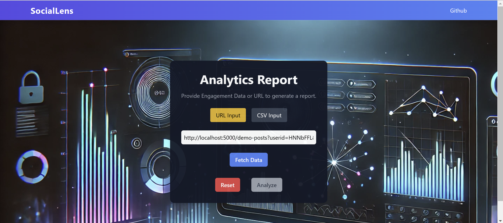

# Social Lens

**Social Lens** is a social media analytics platform designed to help users gain insights from social media data. By leveraging the power of Astra DB, Langflow for natural language processing, and a modern tech stack including React, Express, and Node.js, Social Lens provides users with a seamless way to analyze and understand social media trends, engagement metrics, and more.

## Table of Contents
- [Overview](#overview)
- [Tech Stack](#tech-stack)
- [Features](#features)
- [Installation](#installation)

## Overview
Social Lens analyzes data from social media platforms and provides users with insights such as:
- Popular posts and trends
- Engagement metrics like likes, shares, and comments
- Sentiment analysis using Langflow
- Data visualization for deeper insights

## Tech Stack
- **Astra DB**: A fully managed database service for storing and retrieving social media data.
- **Langflow**: A tool for natural language processing, used for analyzing user comments, posts, and sentiment.
- **React**: Frontend framework for building the user interface of the platform.
- **Express**: Web framework for building the backend API that handles requests and serves data.
- **Node.js**: JavaScript runtime environment to run the backend server.

## Features
- **Social Media Analytics**: Fetch and display social media post data, including likes, shares, and comments.
- **Natural Language Processing**: Use Langflow to analyze social media comments and posts for sentiment and keywords.
- **Data Visualization**: Visualize engagement metrics and trends using interactive charts and graphs.
- **Seamless Integration**: Integrate with popular social media platforms to fetch real-time data

  


## Installation

1. Clone the repository:
   ```bash
   git clone https://github.com/your-username/social-lens.git
   cd social-lens
